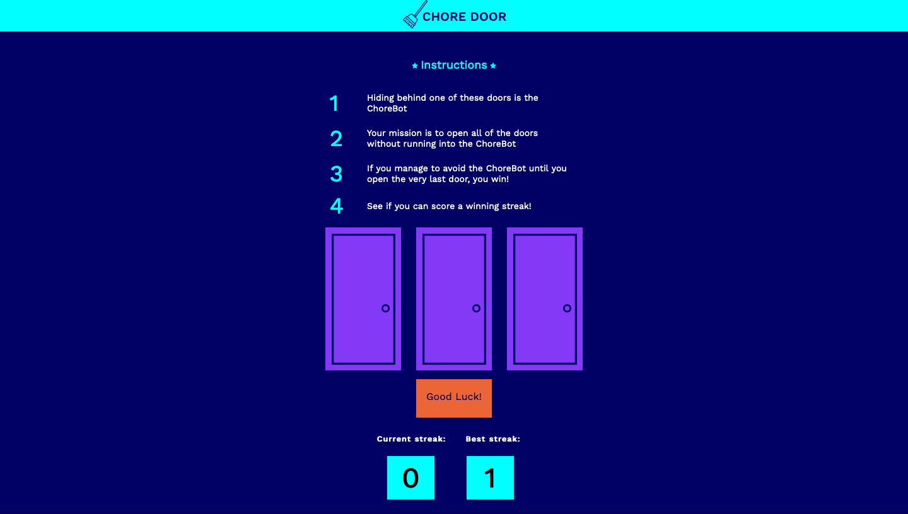

# Chore Door

## Codecademy challenge

## Overview

### The challenge

Your mission is to construct a single-page website that plays a fully-functional game. You will see how HTML, CSS, and JavaScript interact harmoniously to produce a dynamic website.

Follow the link below to see what your game will look like by the end of this project. Play a few rounds and see how you fare against the ChoreBot:

[Chore Door](https://content.codecademy.com/projects/chore-door/chore-door-final/index.html)

My version of the Chore Door:

### Screenshot

